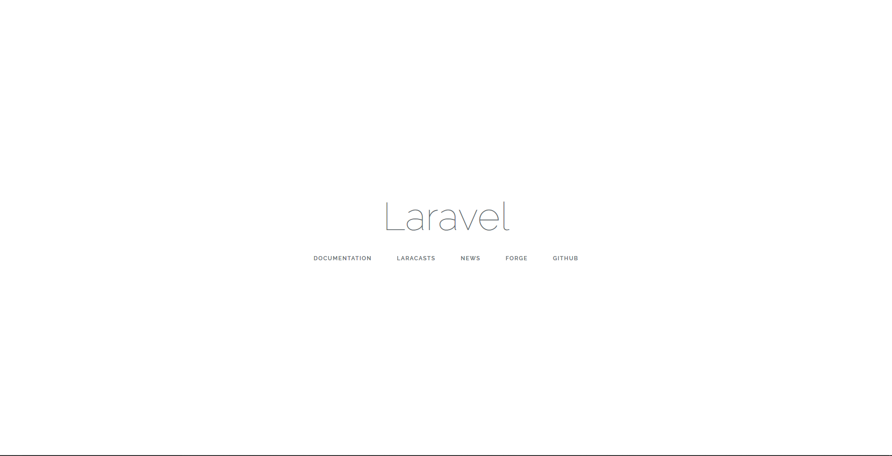

# Workshop Laravel


## Introduction
### Qu'est-ce que Laravel ?

Laravel est un CMS en PHP qui permet de créer un site en suivant un modèle MVC et qui est basé sur Symphony. Sa grosse différence avec WordPress est que Laravel fonctionne de manière beaucoup moins visuelle pour le développeur, ayant une configuration et un développement plus orienté Back-End.
Laravel a une gestion de base de donnée ainsi que de page html propre à elle, que nous verrons plus loin.
Car avant de commencer, installons Composer.

### Composer ? Kézako ? Et quelle nécessité ?


En effet, pour Installer et utiliser Laravel et ses différentes fonctionnalités, il faut tout d'abord utiliser Composer. Et ce dernier est à PHP ce que NPM est à Node.JS. C'est un gestionnaire de dépendances qui permet d'installer, comme sa fonction l'indique, des dépendances et donc des packages de fonctionnalités que l'on peut comparer aux modules Node.JS.

Pour l'installer, suivez le guide: https://getcomposer.org/download/

A présent que Composer est installé, passons à la suite.

### Installation de Laravel

Maintenant que Composer est installé, nous allons nous rendre dans le dossier www contenant nos projets habituels afin de créer notre projet.

!!Attention!! Vérifiez à posséder la version la plus récente de PHP.

ouvrez votre terminal et tapez :
```
composer global require "laravel/installer"
```

Quand celà est fait, tapez : 
```
laravel new nom-de-projet
```

(Pour une fois vous pouvez copier-coller).

Composer va alors initialiser un nouveau projet contenant Laravel.
Vous voulez voir ce que vous avez créé ? Allez sur votre Localhost et ouvrez le dossier contenant le projet (ou ajoutez le sur wamp si vous êtes sur windows, xamp sur mac).
Vous arriverez sur un index ressemblant à ça : 


L'index ne se trouvant pas à la racine du dossier, c'est parfaitement normal. Pour voir la page, vous devez vous déplacer dans le dossier public eeeeeet Tadam ! Magie ! Vous devriez arriver sur quelque chose comme ceci: 



Effectivement, ça change de l'écran d'acceuil de WordPress. Maintenant que tout celà est fait, entrons dans le vif du sujet: Comment qu'on développe en Laravel ?

## Réalisation d'un formulaire 

Rien de tel qu'un bon formulaire pour commencer n'est-ce pas ? (RIP Hacker Poulette).
Tout d'abord, on va voir comment se fait le front-end !
Et pour créer une page formulaire qui comprend l'architecture, il faut utiliser une dépendance de Laravel, j'ai nommé Laravel Collective.

### Installation de Laravel Collective

Pour installer la dépendance, allez dans le fichier composer.json à la racine du dossier et dans require ajoutez une virgule au dernier argument, puis ajoutez la ligne :

```JSON
"laravelcollective/html":"^5.4.0"
```

Quand c'est fait, ouvrez votre terminal dans le dossier et exécutez la commande : 
```
composer update
```
L'installation de la dépendance va alors se lancer.
Ensuite allez dans config/app.php et ajoutez dans "providers" :
```
Collective\Html\HtmlServiceProvider::class,
```
et dans aliases (toujours dans le fichier app.php) :
```
'Form' => Collective\Html\FormFacade::class,
'Html' => Collective\Html\HtmlFacade::class,
```

### Création de la page contenant le formulaire

Il faut savoir une chose avant de commencer à faire notre page: 
Laravel gère ses pages de manière propre en passant par son système appelé "Blade"


(non pas celui-là)

Aussi, on ne crée pas une page n'importe où dans Laravel, il faut aller dans: 
```
resources/views 
```
Où se trouve déjà un fichier welcome.blade.php
Vous pouvez créer un nouveau fichier dans views qu'on va appeler form.blade.php

Ensuite, vous pouvez le remplir avec de l'HTML mais n'allez pas plus loin que la balise body.
Dans celle-ci, on va créer le formulaire en ajoutant ces lignes : 

```php
{!! Form::open('route' => 'Formcontroller@post') !!}

{!! Form::close() !!}
```

J'expliquerai ensuite à quoi sert la route.
Pour ce qui est de ce qu'on vient d'écrire, c'est l'équivalent en html à : 
```html
<form action="lien-du-fichier">

</form>
```

Il faut maintenant ajouter des inputs à notre formulaire. Disons un input texte et un bouton.
Entre les lignes de ce qu'on à écrit auparavant, on va donc ajouter : 
```php
    {{Form::text(name)}}
    {{Form::submit('send!')}}
```

Tout ça c'est bien, mais si à partir de l'index on navigue jusque là, on voit que ça ne fonctionnne pas. Pourquoi ? Parce qu'aucune route et aucun controller ne prend en charge l'affichage. On va donc en créer un !

### Stairway to heaven 

Une route, c'est comme un routeur en MVC, mais avec de la testostérone en plus. Allez dans le dossier routes et ouvrez web.php.
Vous devez avoir quelque chose qui ressemble à ça: 

```php
Route::get('/', function () {
    return view('welcome');
});
```
